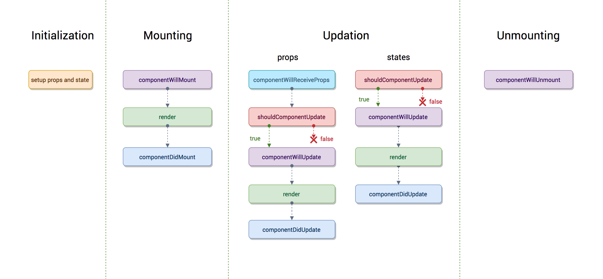

# ECMAScript


## ECMAScript / JavaScript


[Overview of JavaScript ES6 features (a.k.a ECMAScript 6 and ES2015+) | Adrian Mejia Blog](https://adrianmejia.com/blog/2016/10/19/overview-of-javascript-es6-features-a-k-a-ecmascript-6-and-es2015/ "")

---

[The TC39 Process](https://tc39.github.io/process-document/ "")


[tc39/proposals: Tracking ECMAScript Proposals](https://github.com/tc39/proposals "")

---

## ECMAScript Syntax

regex

object.assign


### JSON

JSON syntax is a subset of JavaScript object expression.

* no comments allowed
* `package.json`

---

```json
{
  "firstName": "John",
  "lastName": "Smith",
  "isAlive": true,
  "age": 27,
  "address": {
    "streetAddress": "21 2nd Street",
    "city": "New York",
    "state": "NY",
    "postalCode": "10021-3100"
  },
  "phoneNumbers": [
    {
      "type": "home",
      "number": "212 555-1234"
    },
    {
      "type": "office",
      "number": "646 555-4567"
    },
    {
      "type": "mobile",
      "number": "123 456-7890"
    }
  ],
  "children": [],
  "spouse": null
}
```

---

### JavaScript Object

```javascript
let home = "home ";
let phone = "123456";

let aman = {
    first_name: "fname",
    'middle name': "mname",
    "last name": "lname",
    [home + "address"]: "hz",
    phone
};
JSON.stringify(aman); // "{"first_name":"fname","middle name":"mname","last name":"lname","home address":"hz","phone":"123456"}"
```

---

Array is actually a special object

```js
let arr = [1, 2, 3];
arr.hasOwnProperty(0); // true
arr[6] = 6;
arr; // [1, 2, 3, empty × 3, 6]
Object.keys(arr); // ["0", "1", "2", "6"]
Object.values(arr);
Object.entries(arr);

// `slice()` create a new array reference with the same contents
let arr1 = ["a", "b", "c", "d", "e"];
let arr2 = arr1.slice();
arr1 === arr2; // false
arr2[3] = "c1"
console.log(arr1); // ["a", "b", "c", "d", "e"]
console.log(arr2); // ["a", "b", "c", "c1", "e"]
```

`Object.assign`

```js
let target1 = {a : 1, b : 2};
let target2 = {a : 1, b : 2};
let source1 = {b : 2, c : 3};
let source2 = {b : 5, d : 6};

// Copy properties from each source to the target.
// Note: this WILL MUTATE THE TARGET!
Object.assign(target1, source1, source2);
console.log(target1);
// {a : 1, b : 5, c : 3, d : 6}

// Can be used to safely create copies if the target is a new object:
const newObject = Object.assign({}, target2, source1, source2);

// Result: newObject !== target, and target is unchanged:
console.log(newObject)
// {a : 1, b : 5, c : 3, d : 6}
target1 === newObject; // false

console.log(target2);
// {a : 1, b : 2}

// TODO shallow copy??
```


### `let`, `const`


---

```javascript
var a = 'a';
let b = 'b';
const c = {'c':'c'};

// global scope
window.a // "a"
window.b // undefined
window.c // undefined

// can be reassigned
a = 'a1'; // "a1"
b = 'b1'; // "b1"
c = 'c1'; // Uncaught TypeError: Assignment to constant variable.
c.c = 'd'; // {c: "d"}

// function scope
let fun = function () {
	var i = 1;
	let j = 2;
	const k = 3;
	console.log(i);
	console.log(j);
	console.log(k);
}
fun(); // 1 2 3
console.log(i); // Uncaught ReferenceError: i is not defined
console.log(j); // Uncaught ReferenceError: j is not defined
console.log(k); // Uncaught ReferenceError: k is not defined


// block scope 1
{
	var x = 4;
	let y = 5;
	const z = 6;
}
console.log(x); // 4
console.log(y); // Uncaught ReferenceError: y is not defined
console.log(z); // Uncaught ReferenceError: z is not defined

// block scope 2
for (var v = 1; v < 3; v++) {
	;
}
console.log(v); // 3
for (let l = 1; l < 3; l++) {
	;
}
console.log(l); // Uncaught ReferenceError: l is not defined
```

---

Always define variable as `const`, use `let` unless you know its reference will be changed.

[javascript - What's the difference between using "let" and "var"? - Stack Overflow](https://stackoverflow.com/questions/762011/whats-the-difference-between-using-let-and-var "")


---

### IIFE

[javascript - What does the exclamation mark do before the function? - Stack Overflow](https://stackoverflow.com/questions/3755606/what-does-the-exclamation-mark-do-before-the-function "")


### Symbol


### Function extension

#### Arrow Function (lambda)

```js
function
```

---

#### Default parameter

```js
// Evaluated at call timeSection
function append(value, array = []) {
  array.push(value);
  return array;
}
append(1); //[1]
append(2); //[2], not [1, 2]
```


[Default parameters - JavaScript | MDN](https://developer.mozilla.org/en-US/docs/Web/JavaScript/Reference/Functions/Default_parameters "")

---


### Object extension

```js
var foo = 'bar';
var baz = {foo};
baz // {foo: "bar"}
```

---


module

* `require` and `import`


`class`

decorator


### **Destructuring assignment**

[Destructuring assignment - JavaScript | MDN](https://developer.mozilla.org/en-US/docs/Web/JavaScript/Reference/Operators/Destructuring_assignment "")

---

### Rest/Spread `...`

[Spread syntax - JavaScript | MDN](https://developer.mozilla.org/en-US/docs/Web/JavaScript/Reference/Operators/Spread_syntax "")

[Rest parameters - JavaScript | MDN](https://developer.mozilla.org/en-US/docs/Web/JavaScript/Reference/Functions/rest_parameters "")

[tc39/proposal-object-rest-spread: Rest/Spread Properties for ECMAScript](https://github.com/tc39/proposal-object-rest-spread "")

```js
// Rest properties collect the remaining own enumerable property keys that are not already picked off by the destructuring pattern. Those keys and their values are copied onto a new object.
let { x, y, ...z } = { x: 1, y: 2, a: 3, b: 4 };
x; // 1
y; // 2
z; // { a: 3, b: 4 }

// Spread properties in object initializers copies own enumerable properties from a provided object onto the newly created object.
let n = { x, y, ...z };
n; // { x: 1, y: 2, a: 3, b: 4 }
```


---

### Functional Programming

- **map():** creates a new array with one value for each item in the original array
- **filter():** creates a new array containing only the original values where the callback returned `true`
- **forEach():** doesn't return anything, but lets you do something with each original value
- **reduce():** produces one new value based on the contents of the original array

```js
// map, reduce, filter
const values = [3, 5, 8, 10, 13];

const timesTwo = (num) => num * 2;
const doubledNumbers = values.map(timesTwo);
// [6, 10, 16, 20, 26]


const isEven = (num) => num % 2 === 0;
const evenNumbers = values.filter(isEven);
// [8, 10]


const logValue = (num) => console.log(num);
values.forEach(logValue);
// prints: 3, 5, 8, 10, 13


const addNumbers = (lastResult, currentValue) => {
    return lastResult + currentValue;
}
const sum = values.reduce(addNumbers, 0);
// 39
```

#### Pure Function

* It returns the same result if given the same arguments
* It does not cause any observable side effects


#### Immutability

#### First-class Entity

Functions as first-class entities can:

- refer to it from constants and variables
- pass it as a parameter to other functions
- return it as result from other functions

[Functional Programming Principles in Javascript](https://www.freecodecamp.org/news/functional-programming-principles-in-javascript-1b8fc6c3563f/ "")

#### `map`, `reduce`, `filter` Javascript Array Methods

```js
const numbers = [2, 4, 8, 10];
const halves = numbers.map(x => x / 2);
// halves is [1, 2, 4, 5]

const words = ["spray", "limit", "elite", "exuberant", "destruction", "present"];
const longWords = words.filter(word => word.length > 6);
// longWords is ["exuberant", "destruction", "present"]

const total = [0, 1, 2, 3].reduce((sum, value) => sum + value, 1);
// total is 7

const compose = (...fns) => x => fns.reduceRight((v, f) => f(v), x);
const add1 = n => n + 1;
const double = n => n * 2;
const add1ThenDouble = compose(
  double,
  add1
);
add1ThenDouble(2); // 6
// ((2 + 1 = 3) * 2 = 6)
```

[JavaScript Functional Programming — map, filter and reduce](https://medium.com/jsguru/javascript-functional-programming-map-filter-and-reduce-846ff9ba492d "")

[Simplify your JavaScript – Use .map(), .reduce(), and .filter()](https://medium.com/poka-techblog/simplify-your-javascript-use-map-reduce-and-filter-bd02c593cc2d "")

---


### Module

#### CommonJS

---

#### ES6 Module


`export`

```javascript
// circle.js
const PI = 3.14;
const function circle_area(r) {
    return PI * r * r;
}
export {PI, circle_area}

export default const function(r) { // only one default export
    return 2 * PI * r;
}
```


`import`

```javascript
import length, {PI, circle_area as area} from './circle';
PI;
circle_area(2);
length(2);

import React, {Component, PropTypes} from 'react';
```

---

## Runtime Support

```shell
npm install -g es-checker
es-checker
```

---


## Debug Tricks

```js
console.info("output variable", window.Date());

```


# HTML5 and CSS


## CSS 


## Font


# Node.js


## npm (Node Package Manager)

### package.json

Difference between run in command line and run script in `package.json`?

---

## npx (Node Package Executor ??)

[npx  -  npm](https://www.npmjs.com/package/npx "")

[Introducing npx: an npm package runner – Kat Marchán – Medium](https://medium.com/@maybekatz/introducing-npx-an-npm-package-runner-55f7d4bd282b "")

[javascript - Difference between npx and npm? - Stack Overflow](https://stackoverflow.com/questions/50605219/difference-between-npx-and-npm "")

---

## [Babel · The compiler for next generation JavaScript](https://babeljs.io/ "")

[Babel · Online REPL](https://babeljs.io/repl "")

[Plugins · Babel](https://babeljs.io/docs/en/plugins/ "")

[babel-preset - npm search](https://www.npmjs.com/search?q=babel-preset "")

```shell
npm install --save-dev babel-preset-latest
npm install --save-dev babel-preset-react

npm install --save-dev babel-preset-stage-0
npm install --save-dev babel-preset-stage-1
npm install --save-dev babel-preset-stage-2
npm install --save-dev babel-preset-stage-3
```

---

`.babelrc`

```javascript
{
  "presets": [
    "es2015",
    "react",
    "stage-0"
  ],
  "plugins": []
}
```

```shell
npm install --global babel-cli
babel example.js --out-file compiled.js
npm install --global babel-cli
babel-node // ES6 REPL
```


---

### babel-polyfill

> In [web development](https://en.wikipedia.org/wiki/Web_development), a **polyfill** is code that implements a feature on [web browsers](https://en.wikipedia.org/wiki/Web_browser) that do not support the feature. Most often, it refers to a [JavaScript](https://en.wikipedia.org/wiki/JavaScript) [library](https://en.wikipedia.org/wiki/Library_(computing)) that implements an [HTML5](https://en.wikipedia.org/wiki/HTML5) [web standard](https://en.wikipedia.org/wiki/Web_standard), either an established standard (supported by some browsers) on older browsers, or a proposed standard (not supported by any browsers) on existing browsers.
>
> 
>
> A polyfill is a piece of code (usually JavaScript on the Web) used to provide modern functionality on older browsers that do not natively support it.
>
> [Polyfill - MDN Web Docs Glossary: Definitions of Web-related terms | MDN](https://developer.mozilla.org/en-US/docs/Glossary/Polyfill "")

---

Support new API:

Iterator, Generator, Set, Maps, Proxy, Reflect, Symbol, Promise, Object.assign

[@babel/polyfill · Babel](https://babeljs.io/docs/en/babel-polyfill "")

```javascript
import 'babel-polyfill'
// or
require('babel-polyfill')
```

---


## Webpack

### Concepts

* Entry
* Output
* Plugin
* Module


#### CSS processing

* sass-loader
* postcss-loader
* css-loader
* style-loader

TODO ExtractTextPlugin("bundle.css")

DefinePlugin

HtmlWebpackPlugin


---

## ESLint

`eslint --init`


---


# React


## `props` and `state`


## JSX

---

## VirtualDOM

## Life Cycle


---


---


---

[ReactJs component lifecycle methods — A deep dive – Hacker Noon](https://hackernoon.com/reactjs-component-lifecycle-methods-a-deep-dive-38275d9d13c0 "")



---

---

## State Management


---


---


---


---


---

`state` tree design

---

## fetch and thunk


---


---


---

[淺談 Redux Thunk](https://www.slideshare.net/ssuserc4dc6d1/redux-thunk "")

[[ Part 3 ] First Async call, redux-thunk](http://dev.basharallabadi.com/2018/09/part-3-first-async-call-redux-thunk.html "")

[Quick Start · React Redux](https://react-redux.js.org/introduction/quick-start "")

---

## Usual Component

### IntlProvider

`window.Intl`


### Provider

store

### DragNDrop

HTML5 Drag and Drop


# Component Showcase


# Debug Tools

## Chrome Developer Tools

* Elements DOM, CSS
* Console `console.info("variable name: ", var);`
* Network, check cache
* Souce debug with break point

## Fiddler


## BrowserSync  ??


# Reference

## Handy Tools

React Developer Tools: [facebook/react-devtools: An extension that allows inspection of React component hierarchy in the Chrome and Firefox Developer Tools.](https://github.com/facebook/react-devtools "")

Alternative method: bind store to window object


Redux DevTools: [zalmoxisus/redux-devtools-extension: Redux DevTools extension.](https://github.com/zalmoxisus/redux-devtools-extension "")

React Performance Devtool: [nitin42/react-perf-devtool: A browser developer tool extension to inspect performance of React components.](https://github.com/nitin42/react-perf-devtool "")

---

## ECMAScript

[JavaScript for Java Developers -- Mark Erikson](https://blog.isquaredsoftware.com/presentations/2019-05-js-for-java-devs/#/ "")

 [JavaScript 教程 - 阮一峰](https://wangdoc.com/javascript/ "") （ECMAScript 5）

[ruanyf/es6tutorial: 《ECMAScript 6入门》](https://github.com/ruanyf/es6tutorial "")

---

## React & Redux

[深入浅出React和Redux (豆瓣)](https://book.douban.com/subject/27033213/ "")

[深入浅出React和Redux (实战)-Kindle商店-亚马逊中国](https://www.amazon.cn/mn/detailApp/ref=asc_df_B071F89KXV1558664999000/?asin=B071F89KXV&tag=douban_kindle-23&creative=2384&creativeASIN=B071F89KXV&linkCode=df0 "")

[Redux 中文文档 · GitBook](http://cn.redux.js.org/index.html "")，推荐

* [Action](http://cn.redux.js.org/docs/basics/Actions.html "")

Slides By Mark: [Intro to React and Redux](https://blog.isquaredsoftware.com/presentations/2018-03-redux-fundamentals/#/ "")


---

## Webpack

[Foreword](https://survivejs.com/webpack/foreword/ "")


## React面试题

[【react面试题】不可错过的react 面试题 「务必收藏」 - 前端观澜 - SegmentFault 思否](https://segmentfault.com/a/1190000016761186 "")

[常见react面试题汇总（适合中级前端） - 个人文章 - SegmentFault 思否](https://segmentfault.com/a/1190000016885832 "")

[React 常用面试题目与分析 - 知乎](https://zhuanlan.zhihu.com/p/24856035 "")

[2019必须要会的 50 个 React 面试题 - 极客教程](https://www.geekjc.com/post/5cabf9368024b76bc346b06f "") ★★★★★


## 双向绑定


[数据双向绑定的分析和简单实现 - 知乎](https://zhuanlan.zhihu.com/p/25464162 "")

> 自从Angularjs火起来之后，双向绑定经常被提及。双向绑定概念其实很简单，就是视图（View）的变化能实时让数据模型（Model）发生变化，而数据的变化也能实时更新到视图层。我们所说的单向数据绑定就是从数据到视图这一方向的关系。

[DMQ/mvvm: 剖析vue实现原理，自己动手实现mvvm](https://github.com/DMQ/mvvm "")


# Markdown to Slides

[gnab/remark: A simple, in-browser, markdown-driven slideshow tool.](https://github.com/gnab/remark "")

* [Feature request: image scaling · Issue #72 · gnab/remark](https://github.com/gnab/remark/issues/72 "")


# 其它

[    How to learn React.js in 2019 - RWieruch  ](https://www.robinwieruch.de/learn-react-js/ "")

[ReactJS Tutorial - TutorialsPoint](https://www.tutorialspoint.com/reactjs/ "")

[How to Learn React — A roadmap from beginner to advanced](https://www.freecodecamp.org/news/learning-react-roadmap-from-scratch-to-advanced-bff7735531b6/ "")

[React Redux Tutorial for Beginners: The Definitive Guide (2019)](https://www.valentinog.com/blog/redux/ "")

[React Tutorial: Introduction | Build with React JS](http://buildwithreact.com/tutorial "")，小专题教程，带练习

[Intro to React and Redux](https://blog.isquaredsoftware.com/presentations/2018-03-redux-fundamentals/#/ "")， Redux维护者的PPT，讲解很清晰，动图很有启发性，推荐

* 相关的Slides： [     Reactathon Presentation: Redux Fundamentals ·  Mark's Dev Blog  ](https://blog.isquaredsoftware.com/2018/03/presentation-reactathon-redux-fundamentals/ "")


## React项目

[chvin/react-tetris: Use React, Redux, Immutable to code Tetris. 🎮](https://github.com/chvin/react-tetris "")

[shinima/battle-city: 🎮 Battle city remake built with react.](https://github.com/shinima/battle-city "")